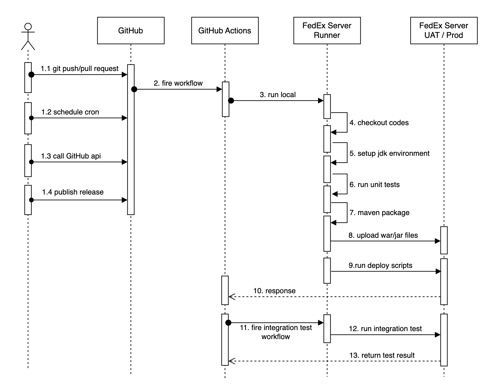
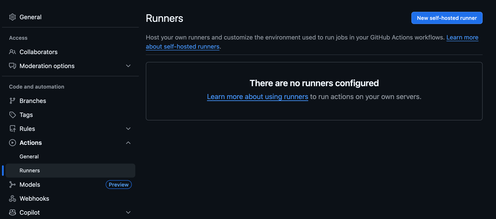
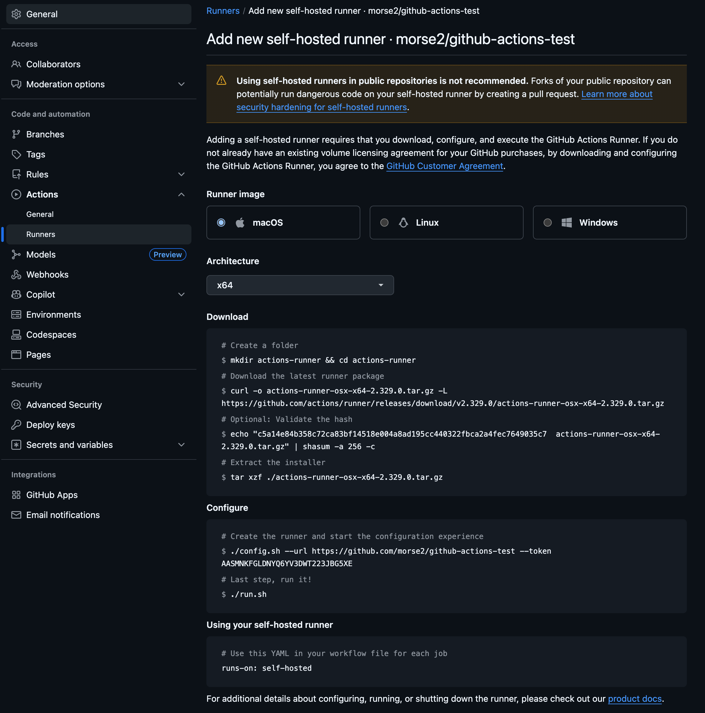
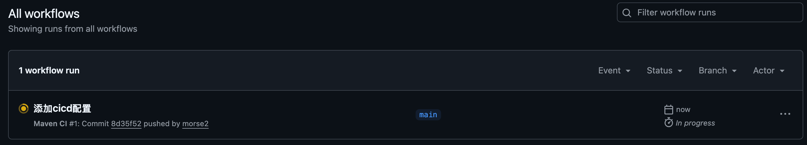
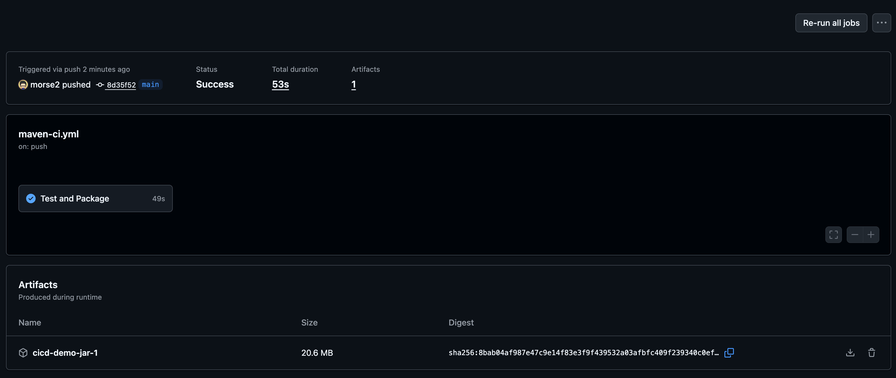
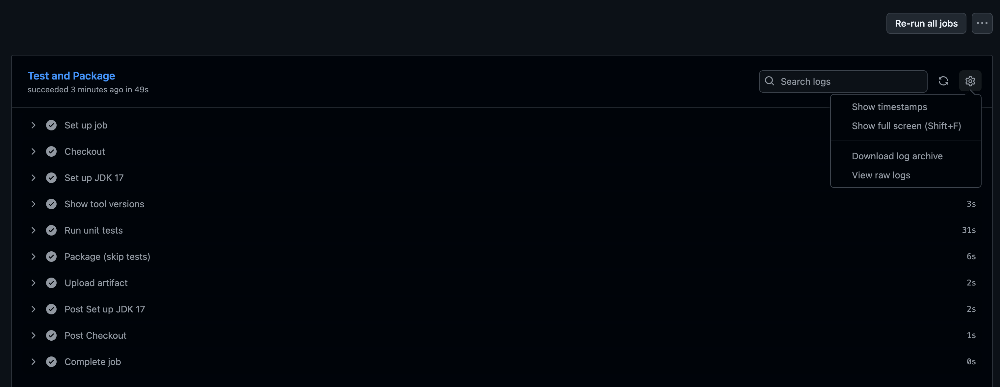
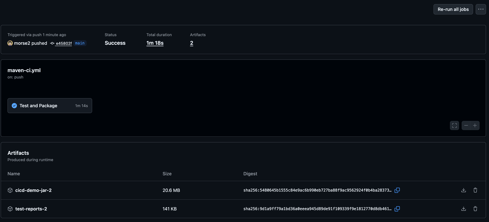

= FedEx 代码自动化测试部署方案
:doctype: article
:toc: left
:toc-title: 目录
:toclevels: 3
:sectnums:
:sectanchors:
:source-highlighter: rouge
:listing-caption: 代码示例

== 我们的项目

我们是基于 Spring Boot 开发的项目结构，并且使用 Maven 进行构建管理，可以快速地执行 CI/CD 构建过程，在开发环境中，使用了 Gitlab 提供的 CI/CD 工具进行开发环境的自动化测试和部署。我们目前主要用到的是单元测试，在打包时候，进行核心功能的测试，测试通过后，才会进行打包发布。

*我们用到的Java版本和框架如下：*

- Java 17
- Spring Boot 3.x
- Maven 3.8+
- Junit 5

== FedEx CI/CD 选型

=== 为什么选择 GitHub Actions
目前使用比较多的CI/CD工具有：Jenkins、Gitlab CI/CD、GitHub Actions等。 我们选择 GitHub Actions 作为我们的持续集成和持续部署（CI/CD）工具，主要基于以下几个原因：

- FedEx 目前使用 GitHub 作为代码托管平台，GitHub Actions 与 GitHub 仓库无缝集成，简化了配置和管理流程。
- GitHub Actions 提供丰富的社区支持和预构建的 Actions，可以快速搭建 CI/CD 流程。
- GitHub Actions 支持多种触发条件（如代码推送、Pull Request、定时任务等），灵活性高。
- GitHub Actions 支持多种操作系统和运行环境，满足不同项目的需求。

=== GitHub Actions 与 Jenkins 比较
[cols="3,4,4", options="header"]
|===
| 比较维度 | GitHub Actions | Jenkins
| 架构设计
| 云原生架构，无需自建服务器
| Master/Agent分布式架构，需要自建和维护服务器
| 维护成本
| 零维护成本，由GitHub托管
| 需要专门的运维团队维护服务器、更新和安全补丁
| 集成能力
| 与GitHub无缝集成，支持GitHub生态系统
| 插件化架构，可与几乎所有工具集成（约2000+插件）
| 配置方式
| 基于YAML文件，存储在 .github/workflows/ 目录
| 基于UI界面配置或Jenkinsfile（声明式/脚本式）
| 学习曲线
| 相对平缓，YAML格式直观
| 较陡峭，特别是对于复杂配置和插件使用
| 扩展性
| 通过Actions Marketplace扩展，社区活跃
| 几乎无限扩展，可自定义插件和Agent
| 运行环境
| 支持Linux、Windows、macOS及自托管运行器
| 支持各种操作系统，可在任何环境中部署Agent
| 成本
| 提供免费额度，超出部分按量付费
| 开源免费，但服务器硬件和运维成本较高
| 安全特性
| 内置Secrets管理，环境隔离，安全审核机制
| 需要通过插件和配置实现安全策略，较复杂
| 性能优化
| 提供缓存机制，支持并行作业
| 可通过分布式构建、缓存和自定义优化大幅提升性能
| 企业级支持
| GitHub企业版支持，文档完善
| 专业支持服务可通过CloudBees获取，社区支持强大
|===

=== 增加集成测试

对于Java项目，我们除了使用 Junit 单元测试外，还引入 TestNG 进行集成测试。

目前的单元测试可以保证核心功能的正确性，但在多个系统之间的功能协同和集成方面，单元测试的覆盖面有限。通过引入集成测试，我们可以模拟真实的使用场景，验证各个组件之间的交互是否符合预期，从而提高系统的可靠性。

- 全面的测试支持，可以完整地验证系统功能
- 模拟真实环境，确保各个组件协同工作正常
- 回归测试，确保修改不会破坏现有功能
- 并行执行，提高测试效率，缩短执行时间
- 提供更高的测试覆盖率

下面是一个集成测试样例：

[source,java]
----
@Test(description = "Personal Keywords Remote API Test",
        suiteName = "Jet Api Integration Test", priority = 1)
void remoteApiTest() {
    String url = "https://newtg.natapp4.cc/midjetapi/personal-keywords/list?keyword=123&page=1&size=10";
    RequestEntity<Object> request = new RequestEntity<>(HttpMethod.GET, URI.create(url));
    ParameterizedTypeReference<Map<String, Object>> responseType = new ParameterizedTypeReference<>() {};
    ResponseEntity<Map<String, Object>> response = restTemplate.exchange(request, responseType);
    assertNotNull(response);
    assertNotNull(response.getBody());
}
----

== GitHub Actions 简介

GitHub Actions 是 GitHub 提供的持续集成/持续部署(CI/CD)平台，它直接集成在 GitHub 仓库中。通过 GitHub Actions，开发团队可以自动化他们的软件开发工作流程，包括构建、测试、打包、发布和部署代码。

== GitHub Actions & FedEx CI/CD 流程
[image,png]

== GitHub Actions 核心概念

=== 工作流 (Workflow)

- 定义在 YAML 文件中的自动化过程
- 存储位置：`.github/workflows/` 目录
- 触发条件：基于 GitHub 事件（代码推送、PR 创建、标签发布等）

=== 事件 (Event)

- 触发工作流运行的操作或状态变更
- 常见事件类型：
  - `push`: 代码推送到仓库
  - `pull_request`: 创建或更新 Pull Request
  - `release`: 发布新版本
  - `schedule`: 定时触发（使用 cron 表达式）
  - `workflow_dispatch`: 手动触发

=== 作业 (Job)

- 工作流中在同一运行器上执行的一组步骤
- 作业之间可以定义依赖关系（使用 `needs` 关键字）
- 支持并行执行多个作业，提高效率

=== 步骤 (Step)

- 单个任务单元，可以是操作或 shell 命令
- 步骤按顺序执行，一个步骤失败会导致后续步骤不执行（除非特别配置）
- 每个步骤都在同一作业的上下文中运行，可以共享数据

=== 操作 (Action)

- 可重用的任务组件，封装了复杂功能
- 来源类型：
  - 官方提供的 Actions（如 `actions/checkout@v4`）
  - 社区贡献的 Actions（通过 GitHub Marketplace 获取）
  - 自定义 Actions（可以在仓库中创建）

=== 运行器 (Runner)

- 执行工作流的服务器环境
- GitHub 托管运行器：
  - Linux (Ubuntu)
  - Windows
  - macOS

== 配置 Self-hosted Runner

由于GitHub actions 默认是运行在托管服务器上的，由于安全原因，是无法直接访问内网资源的，所以在这个时候，我们需要配置自托管运行器（Self-hosted Runner），将运行器部署在可以访问内网资源的环境中。

**配置步骤：**

1. 进入 GitHub 仓库页面，点击 "Settings"。
2. 在左侧菜单中选择 "Actions" > "Runners"。
3. 点击 "New self-hosted runner" 按钮，选择操作系统（Linux、Windows、macOS）。
4. 按照页面上的指示，下载并配置运行器软件。
5. 启动运行器，确保其处于运行状态并连接到 GitHub 仓库。

[image,png]

[image,png]

== Workflow 配置示例

Workflow 配置文件使用 YAML 格式，以下是一个样例文件：

当代码被 push 到仓库中时候，则会触发此 workflow 的执行。

[source,yaml]
----
name: Maven CI

on:
  push:
    branches: [ "**" ]
  pull_request:

concurrency:
  group: ${{ github.workflow }}-${{ github.ref }}
  cancel-in-progress: true

jobs:
  build:
    name: Test and Package
    runs-on: ubuntu-latest
    permissions:
      contents: read

    steps:
      - name: Checkout
        uses: actions/checkout@v4

      - name: Set up JDK 17
        uses: actions/setup-java@v4
        with:
          distribution: temurin
          java-version: '17'
          cache: maven

      - name: Show tool versions
        run: |
          java -version
          mvn -v

      - name: Run unit tests with JaCoCo agent
        run: mvn -B -ntp -DskipTests=false clean org.jacoco:jacoco-maven-plugin:0.8.12:prepare-agent test
        continue-on-error: true

      - name: Generate HTML reports (JaCoCo + Surefire)
        run: mvn -B -ntp org.jacoco:jacoco-maven-plugin:0.8.12:report org.apache.maven.plugins:maven-surefire-report-plugin:3.5.0:report-only
        if: always()

      - name: Package (skip tests)
        run: mvn -B -ntp -DskipTests package
        if: always()

      - name: Upload JAR artifact
        uses: actions/upload-artifact@v4
        if: always()
        with:
          name: CI/CD-demo-jar-${{ github.run_number }}
          path: target/*.jar

      - name: Upload test reports
        uses: actions/upload-artifact@v4
        if: always()
        with:
          name: test-reports-${{ github.run_number }}
          path: |
            target/surefire-reports/**
            target/reports/**
            target/site/jacoco/**

----

== GitHub Actions 实践

- 当我们成功 push 代码到 GitHub 仓库上后，会自动触发 GitHub Actions 工作流的执行。我们通过 Actions 页面，可以查看到当前工作流的执行状态。

[image,png]

- 我们可以点击进入当前工作流，查看具体的执行日志和状态。

[image,png]

- 我们可以查看每个作业的执行情况，包括每个步骤的日志输出，方便我们进行调试和问题排查。

[image,png]

- 最终，我们可以在工作流执行完成后，下载生成的构建产物（如 WAR/JAR 包、测试报告等）。

[image,png]

== 总结

GitHub Actions 提供了强大而灵活的 CI/CD 功能，与 GitHub 生态深度集成，使得自动化软件交付流程变得简单高效。通过合理配置和遵循最佳实践，团队可以显著提高开发效率，确保代码质量，加速软件交付过程。

== 参考资源

* https://github.com/morse2/github-actions-test.git[测试代码仓库,window=_blank]
* https://github.com/morse2/github-integration-test.git[集成测试代码仓库,window=_blank]
* https://docs.github.com/cn/actions[GitHub Actions 官方文档,window=_blank]
* https://github.com/marketplace/actions[GitHub Marketplace,window=_blank]
* https://github.com/actions/starter-workflows[GitHub Actions 示例工作流,window=_blank]
* https://docs.github.com/cn/actions/learn-github-actions/security-hardening-for-github-actions[GitHub Actions 安全强化指南,window=_blank]
